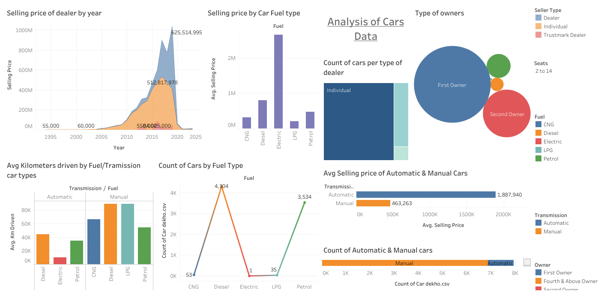

# AutoPulse: Tracking the heartbeat of the used Car Market 

This repository contains Tableau dashboard, visualization, and data analysis projects I have created.

## Exploring Trends in the Automotive Industry

 [Exploring Trends in the Automotive Industry.twbx](Exploring Trends in the Automotive Industry.png)

 ## Project Description

 This project involved creating an interactive Tableau dashboard to visualize and analyze used car sales data. The key goals were to:

- Provide insights into sales trends over time
- Compare performance by transmission, fuel type, ownership etc.
- Analyze sales and pricing by different car segments
- Identify relationships between mileage, age and pricing
- Enable data-driven decision making for inventory, pricing and marketing

The dashboard combines used car listing data from various sources. It allows slicing and dicing - the data by relevant dimensions using filters and parameters.

Key visualizations include:

- Sales price trends over time
- Analysis of average pricing, mileage by fuel type, transmission
- Used car volume by dealer type, owner types
- Correlation analysis between pricing factors
- Forecasting of future pricing based on trends

## Analyzing Employee Trends

## About Tableau

Tableau is a powerful data visualization and business intelligence tool. Some key features:

- Drag and drop interface to build interactive dashboards 

- Broad data connectivity to combine data sources 

- Diverse visualization types including maps, charts, graphs etc.

- Smart analytics with trendlines, forecasting, clustering etc.

- Sharing capabilities for visualizations and dashboards

## How to Use

1. Download and install Tableau Desktop
2. Download the .twbx file for any project
3. Open the file in Tableau to interact with the visualizations
4. Connect to your own data sources to create custom dashboards
